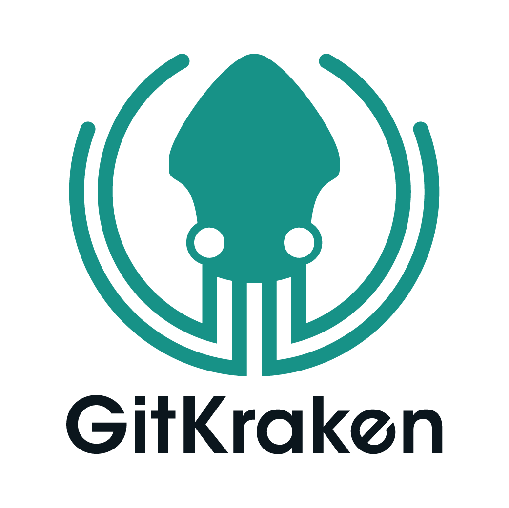

# Software Engineering Intern - Docugami
</img>

---

## Apply

- https://www.ziprecruiter.com/jobs/gitkraken-4a1d96f0/software-engineering-internship-6ee344ca?tsid=122001595&enc_campaign_id=18faa86c

## Location

- Scottsdale, Arizona, USA

## Remote
- No

## Description
The Company:

GitKraken makes a suite of legendary Git tools that help developers be more productive – and teams collaborate more closely – wherever they are and wherever they code. GitKraken tools – including the GitKraken Client, and newly acquired GitLens, and Git Integration for Jira – are used by more than 10 million developers at 100,000 organizations around the world. We help them solve big problems like climate change, space travel, curing disease, education and secure commerce. We are a profitable, sustainably growing tech company that values talent, drive, and the ability to make an impact. Join us!

The Role:

At GitKraken, our Software Engineers are focused on driving the success of our highly technical user base of 10m+ developers and technologists at 100k+ organizations worldwide through product innovation. We are hiring Software Engineer Interns for the summer to work alongside our global team of developers to assist in the development of innovative product features for our Git productivity and collaboration tools, and gain valuable insight into the makings of a high-growth software company. Software Engineer Internships at GitKraken are optimized for students. To be eligible you must be a university student during the internship period.

We are committed to having an inclusive and authentic work environment where unique perspectives, skills, and backgrounds are celebrated. We work hard to foster diversity in our workplace and encourage people from all backgrounds to apply. Even if you don't meet 100% of the requirements, don't let self-filtering and imposter syndrome get in the way of a great fit. We would love to hear from you!

What you'll bring:

While we don’t consider any one technology critical — software engineers can easily pick up new technologies — we do have some guidelines:

A Core Knowledge of Software Engineering: We expect a solid foundation of software development and algorithms in one of these programming languages: C, C++, C#, Java or Javascript
UI Front-End development in Javascript: Knowledge of Javascript fundamentals is essential, but experience with React.js, Node.js, Redux.js and Typescript can put you ahead
Understanding of Database Development: You might be expected to interface with a database system such as MongoDB or SQL Server
Electron: Knowledge or experience developing Electron applications is a huge plus
Experience with Dev Tools: If you have expertise with Git, GitHub, GitKraken, CircleCI, Travis, Appveyor, Docker or Jenkins, that's a big plus.

Candidate information:

The GitKraken 2022 Summer Internship program is not accepting candidates having any type of Visa sponsorship requirements.

Equal Employment Opportunity Statement:

At GitKraken, we believe that diversity among our teammates is critical to our success as a company. GitKraken evaluates all employees and job applicants without regard to race, color, religion, gender (including pregnancy, gender expression, or gender identity), national origin, age, disability status, or any other legally protected class. We recruit, hire, and retain top talent from a diverse candidate pool.