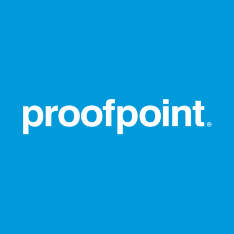

# Software Engineering Intern - Proofpoint
</img>

---

## Apply

- https://proofpoint.wd5.myworkdayjobs.com/ProofpointCareers/job/Draper-UT/Software-Engineer-Summer-Intern---Undergrad_R8451

## Location

- Washington, DC, USA

## Remote
- Yes

## Description
The Role

Proofpoint is looking for an excellent software engineer to fill a summer internship position in its machine learning (ML) group. This group is responsible for building a variety of ML-enabled systems for a diverse array of products. We work across the entire data science lifecycle, including data analysis, model training, and production inference.

Proofpoint's ML group builds and maintains a cloud platform for its work across the data science lifecycle. We need a solid software engineer who can help us add features to this platform to improve our resource utilization and cost optimization. This role will primarily be using the Python language, and will work with a huge variety of cloud services from AWS. You will succeed in this internship if you have excellent software development skills and a desire to master a wide array of cloud technologies.

Job Requirements

Python programming experience
Public cloud systems such as AWS, Azure, or GCP
Understanding of network and infrastructure topics such as TCP/IP, DNS, etc.    
Experience writing clean and readable code    
Excellent interpersonal and communication skills
Understanding of declarative infrastructure-as-code (IAC) tools such as Terraform
A desire and willingness to learn many new services and tools during the internship   
Candidate Profile

You have the ability and interest working part time (maximum 30 hours/week) from our Draper, UT office or remotely until it is safe to return onsite. You are currently pursuing an undergraduate degree and maintaining an above average GPA. This internship is scheduled to start immediately and run through the end of August 2023.

#LI-Remote

If you like wild growth and working with happy, enthusiastic over-achievers, you'll enjoy your career with us!